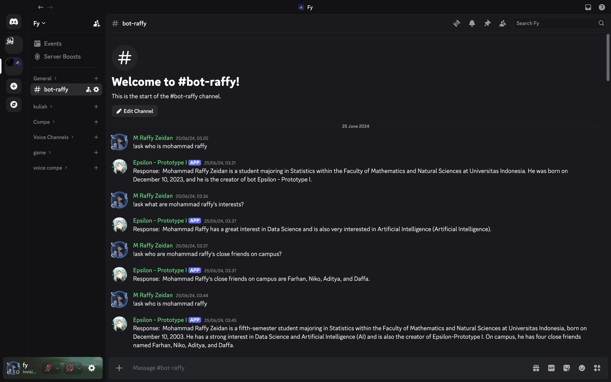

<div align="center">

# Epsilon RAG

**A private, local-first knowledge assistant for Discord and the command line.**

[](https://www.python.org/)
[](https://www.langchain.com/)
[](https://ollama.com/)
[](https://www.trychroma.com/)
[](https://discord.com/developers/docs/intro)
[](LICENSE)

</div>

Epsilon RAG turns PDF documents into a searchable local knowledge base. It retrieves the most relevant passages with Chroma, generates grounded answers through a local Ollama model, and exposes the result through a Discord bot or a lightweight CLI.

## Demo

<p align="center">
  
</p>

The screenshot shows the original Epsilon prototype answering questions from an indexed personal profile document directly inside Discord. Users invoke the assistant with `!ask`, while the bot retrieves relevant context and generates a natural-language response.

### Example interaction

```text
User: !ask what are Mohammad Raffy's interests?

Epsilon: Mohammad Raffy has a great interest in Data Science and is also
very interested in Artificial Intelligence.
```

## Highlights

- Local-first generation with Ollama; document context stays on your machine.
- Incremental PDF indexing with stable chunk identifiers.
- Semantic retrieval powered by Hugging Face embeddings and Chroma.
- Discord `!ask` command plus a standalone query CLI.
- Environment-based secrets and centralized configuration.

## How it works

1. PDF files from `data/` are loaded and split into overlapping text chunks.
2. Each chunk is converted into a semantic embedding with Sentence Transformers.
3. Chroma stores the embeddings and retrieves the chunks closest to a question.
4. The retrieved text and question are passed to Mistral through Ollama.
5. The answer and its document sources are returned through Discord or the CLI.

## Architecture

```text
PDF files → text chunks → embeddings → Chroma
                                      ↓
Discord / CLI → semantic search → Ollama → grounded answer
```

## Tech stack

| Layer | Technology |
|---|---|
| Language | Python 3.11+ |
| RAG orchestration | LangChain |
| Local LLM | Ollama + Mistral |
| Embeddings | sentence-transformers/all-MiniLM-L6-v2 |
| Vector database | Chroma |
| Interface | Discord.py and CLI |

## Getting started

### Prerequisites

- Python 3.11 or newer
- [Ollama](https://ollama.com/) installed and running
- A Discord bot token if you want to use the Discord interface

### Installation

```bash
git clone https://github.com/zzeiidann/Epsilon-RAG.git
cd Epsilon-RAG
python -m venv .venv
source .venv/bin/activate
pip install -e .
cp .env.example .env
ollama pull mistral
```

Place one or more PDF files inside `data/`. This directory is intentionally ignored by Git so private documents are not published.

### Build the knowledge base

```bash
epsilon-index
```

Use `epsilon-index --reset` to rebuild the vector store from scratch.

### Ask from the terminal

```bash
epsilon-query "What are the key points in the document?"
```

### Run the Discord bot

Set `DISCORD_TOKEN` in `.env`, enable the **Message Content Intent** in the Discord Developer Portal, then run:

```bash
epsilon-bot
```

In a channel where the bot is present:

```text
!ask What does the document say about this topic?
```

## Project structure

```text
.
├── data/                       # Local PDF documents (not tracked)
├── src/epsilon_rag/
│   ├── bot.py                  # Discord interface
│   ├── cli.py                  # Terminal interface
│   ├── config.py               # Environment and paths
│   ├── embeddings.py           # Embedding model factory
│   ├── rag.py                  # Retrieval and generation
│   └── store.py                # PDF indexing pipeline
├── .env.example
├── pyproject.toml
└── README.md
```

## Configuration

| Variable | Default | Purpose |
|---|---|---|
| `DISCORD_TOKEN` | — | Discord bot authentication token |
| `OLLAMA_MODEL` | `mistral` | Ollama model used for generation |
| `EMBEDDING_MODEL` | `sentence-transformers/all-MiniLM-L6-v2` | Hugging Face embedding model |
| `RAG_TOP_K` | `7` | Number of document chunks retrieved |

## Use cases

- Personal knowledge assistants built from notes, profiles, or reference documents
- Internal question-answering bots for teams and communities
- Document exploration without sending source material to a hosted LLM API
- Prototyping local retrieval-augmented generation workflows

## Limitations

- The indexing pipeline currently accepts PDF files only.
- Answer quality depends on the source documents, selected model, and retrieved context.
- Ollama must remain running while queries are processed.
- Discord messages are truncated to the platform's 2,000-character limit.
- This project does not yet include authentication or per-server knowledge bases.

## Roadmap

- [ ] Support additional document formats such as Markdown and DOCX
- [ ] Add conversational memory and follow-up questions
- [ ] Stream responses in Discord
- [ ] Add automated tests and continuous integration
- [ ] Support separate collections for multiple Discord servers

## Troubleshooting

**The bot starts but does not respond to `!ask`.** Ensure Message Content Intent is enabled both in the Discord Developer Portal and in the bot configuration.

**Ollama cannot connect.** Run `ollama serve`, verify that it is available locally, and download the configured model with `ollama pull mistral`.

**No relevant information is returned.** Add PDFs to `data/` and run `epsilon-index --reset` before querying again.

**The first indexing run is slow.** The embedding model is downloaded on first use and cached for subsequent runs.

## Privacy

PDF files, the generated Chroma database, environment secrets, and model artifacts are excluded from version control. Before publishing a previously private repository, inspect its Git history as ignored files may still exist in earlier commits.

## License

Distributed under the [MIT License](LICENSE).
